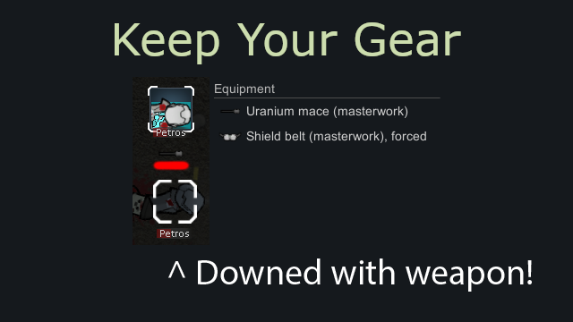

# Reequip Weapon Upon Recovery


Keep weapon and inventory with a pawn when it is downed instead of throwing everything
on the ground. Successor of "Do Not Drop Weapon" and "Where Is My Weapon?" with a
better implementation.

Available on the [Steam Workshop](https://steamcommunity.com/sharedfiles/filedetails/?id=3234461612).

## How it works

Downed pawns keep their weapon and inventory until they recover - colonists and
enemies alike, each side with its own options. Everything else works like vanilla:

- Stripping always works - on downed pawns, prisoners and corpses.
- Capturing or selling a pawn drops its gear, exactly like vanilla.
- A kidnapped pawn drops its gear where it was grabbed, so it stays recoverable
  instead of leaving the map with the kidnapper.
- Destroyed hands no longer disarm a pawn: the weapon stays equipped and is usable
  again once the pawn can hold things.
- Pawns that spawn downed - rescued allies, quest survivors, save loading - keep
  their weapon too.

## Settings

Separate options for colonists and for other pawns, each covering weapons and
inventory, on downed and on death. The "dead" options work standalone, so a pawn can
drop everything when downed but keep it on death, or the other way around. Colony
animals and slaves count as colonists; prisoners and visitors count as other pawns.

## Things to keep in mind

Deliberate trade-offs that keep the mod balanced:

- A downed enemy who recovers wakes up still armed - keeping gear means keeping it
  for everyone.
- Gear kept on dead pawns stays on the corpse: strip the body to take it, or it is
  destroyed when the corpse rots away.

## Known limitations

- A downed pawn's kept inventory cannot be accessed directly; recover, strip, capture
  or kill the pawn to get at it.
- Enemies rescued by their own faction leave the map with their gear.
- A weapon kept despite lost manipulation stays unusable until the pawn can hold
  things again.
- Gear drops forced by other mods stay vanilla; only the four vanilla drop moments
  are covered.

## Technical notes

- Requires RimWorld 1.5 or 1.6 and the [Harmony](https://steamcommunity.com/sharedfiles/filedetails/?id=2009463077) mod.
- Pure Harmony: no def changes and nothing saved to the game state, safe to add and
  remove at any time.
- Pawns are marked only for the duration of the vanilla calls that would strip them
  (`MakeDowned`, `Kill`, `Notify_PawnSpawned`, `CheckForStateChange`); the drop
  methods are prevented only for marked pawns, so stripping, capture, trading and
  caravan handling keep their vanilla behavior.
- Marks are cleaned up in Harmony finalizers that preserve exceptions - a failed drop
  can never leak onto another pawn.
- Every patch is applied in its own try/catch: a game update renaming one target logs
  an error and skips just that behavior, the rest keeps working.

## Build from source

Requires the .NET SDK.

```
cd Source/KeepYourGear
dotnet build -c Release -p:RimWorldDir="C:\Path\To\RimWorld"
```

Add `-p:HarmonyDir="C:\Path\To\Harmony"` if Harmony is not installed at the default
Steam Workshop location
(`...\steamapps\workshop\content\294100\2009463077\Current\Assemblies`).

The output lands in `Assemblies/KeepYourGear.dll`; the whole mod folder can be
junctioned or copied into the game's `Mods` directory.
